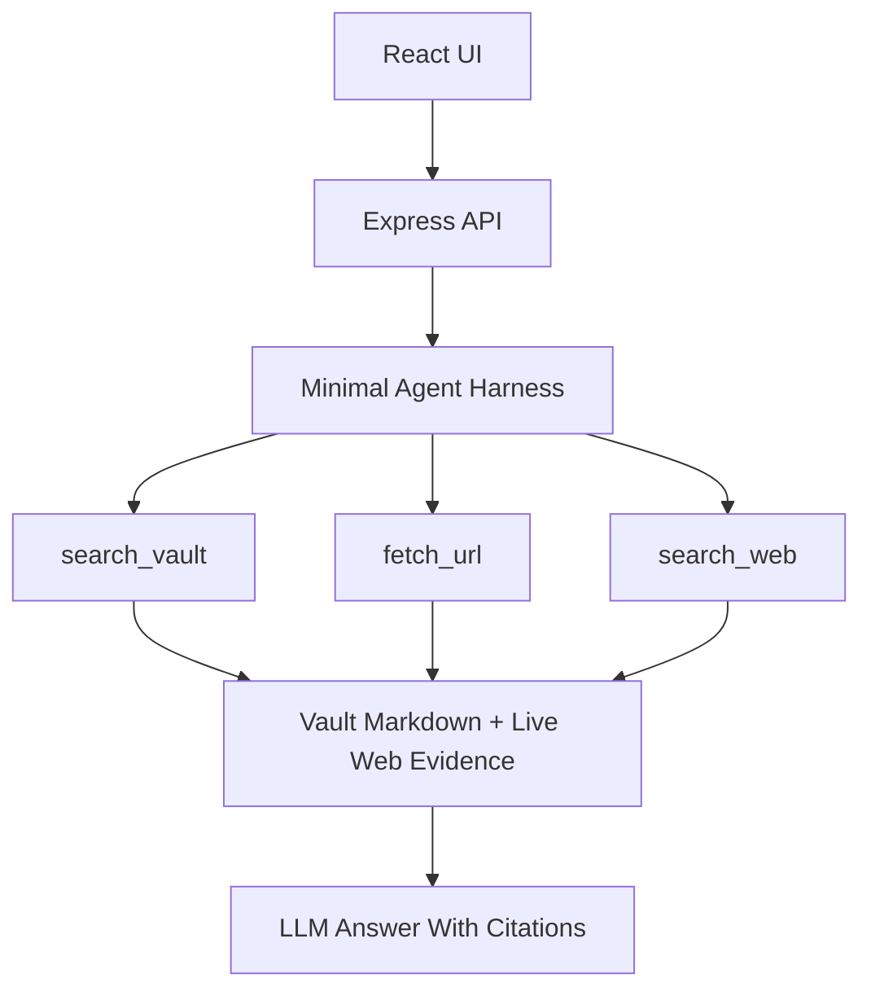
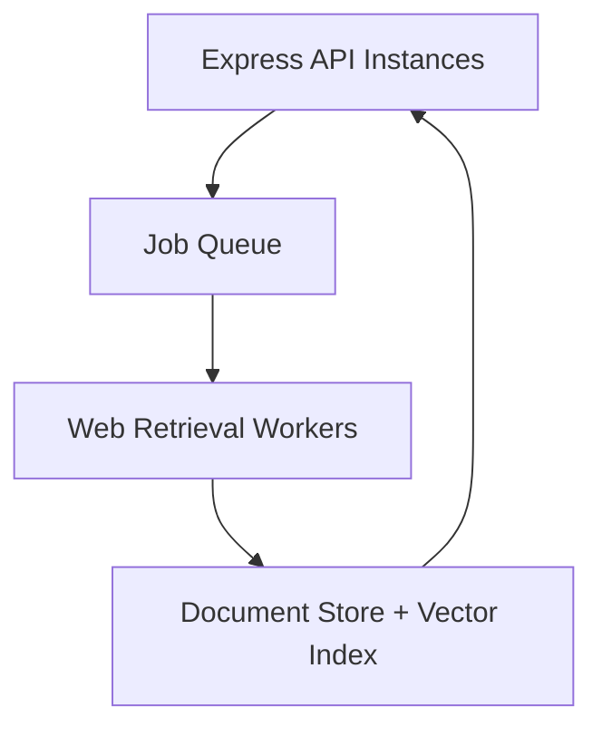

# Architecture

SubsiWiki uses a deliberately small agent harness rather than a large orchestration framework. The goal is to make the agent easy to inspect, easy to constrain, and easy to replace later.

## Runtime Shape



The current harness lives in `server/index.js`. It follows the same simple pattern as the prototype CLI:

1. Start with a system prompt and user question.
2. Call the model with a small tool registry.
3. Execute requested tool calls.
4. Append tool results to the conversation.
5. Stop when the model returns a final answer or the step limit is reached.

## Evidence Model

Vault documents and live web pages are normalized into the same source shape before they reach the answer step:

```ts
type Source = {
  id: number;
  title: string;
  url?: string;
  path?: string;
  kind: string;
  sourceType: 'vault' | 'web';
  excerpts: string[];
};
```

This keeps the citation UI simple. The model cites `[1]`, `[2]`, and so on, regardless of whether the evidence came from Obsidian or the web.

## Tool Policy

The model receives three narrow tools:

- `search_vault(query)` searches local Markdown chunks and should run first.
- `fetch_url(url, reason)` fetches one public URL and turns it into web evidence.
- `search_web(query)` uses Browserbase Search when `BROWSERBASE_API_KEY` is configured.

The system prompt tells the model to prefer the vault, use live web only when needed, prefer official sources, and avoid uncited claims.

## Guardrails

The harness has small hard limits:

- `AGENT_MAX_STEPS` (default 8)
- `AGENT_MAX_WEB_FETCHES` (default 15)
- `AGENT_MAX_WEB_SEARCHES` (default 5)

### SSRF Rules

`fetch_url` validates every URL with `assertPublicHttpUrl` before any network call. The validator rejects:

- Non-`http(s)` protocols.
- `localhost` and any hostname ending in `.local`.
- IPv4 addresses in private ranges (`10/8`, `127/8`, `169.254/16`, `172.16/12`, `192.168/16`, `0/8`).
- IPv6 loopback (`::1`), unique-local (`fc..`, `fd..`), and link-local (`fe80..`) addresses.
- Hostnames whose DNS lookup resolves to any of the above.

User-supplied URLs are never trusted to be public — DNS resolution happens before the fetch so an attacker cannot route the server at internal services via a public hostname that resolves to private space.

## Current Storage

The prototype keeps indexed vault chunks in memory and does not persist fetched web pages. That is fine for a local MVP. For multi-user production, move toward:

- Postgres for documents, runs, users, and source metadata.
- Object storage for raw fetched HTML and artifacts.
- A vector database or Postgres vector extension for chunk retrieval.
- Redis or another queue for long web jobs.

## Scaling Path

The harness can stay small while the infrastructure grows around it:



Browserbase helps avoid operating a browser fleet yourself. If browser sessions, screenshots, downloads, or authenticated browsing become necessary, add them behind the existing `fetch_url` or a new `browser_task` tool rather than exposing broad browser control to the model immediately.

## Why Not a Large Agent Framework Yet?

The system needs evidence discipline more than agent cleverness. A small custom harness makes it clear:

- Which tools exist.
- Which source each claim came from.
- How many web calls a run made.
- Why a URL was fetched.
- Where to add user, tenant, and cost limits later.

Frameworks can be added later if they solve a concrete problem. For now, the compact loop is a feature.
