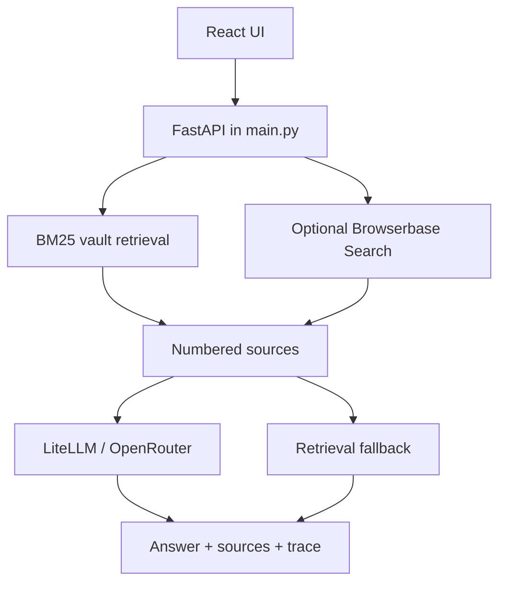

# Architecture

SubsiWiki is a compact React + FastAPI RAG app for asking questions over an
Obsidian-style Markdown vault. The backend is intentionally small: it retrieves
vault evidence, optionally adds Browserbase web search snippets, and makes one
LiteLLM/OpenRouter call to synthesize a cited answer.

## Runtime Shape



The active backend lives in `main.py`. `npm run dev` starts this Python API
alongside the Vite frontend.

## Request Flow

`POST /api/query` accepts:

```json
{
  "question": "What funding could a small manufacturer qualify for?",
  "allowWeb": false,
  "checkSources": false
}
```

The backend then:

1. Searches the local vault with BM25.
2. Searches Browserbase only when `allowWeb` is exactly `true`.
3. Deduplicates and numbers sources.
4. Calls the configured OpenRouter model when `OPENROUTER_API_KEY` is set.
5. Optionally runs a second source-check model when `checkSources` is exactly
   `true`.
6. Returns a deterministic excerpt fallback when the model is unavailable.

## Vault Retrieval

The vault path comes from `VAULT_DIR` and defaults to `SubsiWiki`. Markdown files
are loaded recursively, chunked with LlamaIndex's `SentenceSplitter`, and indexed
with `BM25Retriever`.

The index is cached in process. Web search results use a short TTL cache.
`POST /api/reload` clears the retrieval caches and rebuilds the vault index.

Vault loading is tolerant:

- Missing vault directories return no vault results and emit a warning.
- Empty vault directories return no vault results and emit a warning.
- Individual Markdown files that fail to load are logged with their file path,
  while the remaining files continue to index.

## Source Model

Vault and web search results are normalized into the same response shape:

```ts
type Source = {
  id: number;
  title: string;
  path: string;
  url: string;
  sourceType: 'vault' | 'web';
  excerpts: string[];
  text: string;
  score: number;
};
```

Vault sources use `path`; web sources use `url`. The frontend links bracket
citations like `[1]` back to these numbered sources.

## Answering

When `OPENROUTER_API_KEY` is configured, `main.py` sends the question, numbered
source context, and `system_prompt` from `config.yaml` to LiteLLM. The configured
model comes from `OPENROUTER_MODEL` or `config.yaml`.

When the model key is missing or the model call fails, the API still returns a
retrieval-only answer listing the top source excerpts.

## Source Checking

When `checkSources` is exactly `true`, the backend runs a second, smaller model
after the answer is generated. The verifier receives the final answer and the
retrieved source excerpts, then returns:

```ts
type SourceCheck = {
  status: 'pass' | 'warn' | 'fail';
  summary: string;
  issues: string[];
  citedIds: number[];
  missingCitationIds: number[];
  model: string;
};
```

The verifier model is configurable with `OPENROUTER_SOURCE_CHECK_MODEL` and
defaults to `openai/gpt-5-mini`.

## Trace And Monitoring

Every response includes a `trace` array that records which retrieval steps ran
and which source IDs they produced. Web search failures are logged with the query
and surfaced on the web trace item as `error`, while the answer falls back to any
vault results.

Example trace with a web failure:

```json
[
  { "tool": "search_vault", "input": "latest SME funding", "sources": [1, 2] },
  {
    "tool": "search_web",
    "input": "latest SME funding",
    "sources": [],
    "error": "simulated browserbase outage"
  }
]
```

## Current Scope

The Python backend does not currently implement an agent loop, `fetch_url`, live
page extraction, SSRF validation, or per-request web budgets. Browserbase is
used only for `/v1/search`, and those results are snippets rather than fetched
page contents.

The legacy Node server remains in `server/index.js` for reference and can still
be run with `npm run server:node`, but it is not the default runtime.
