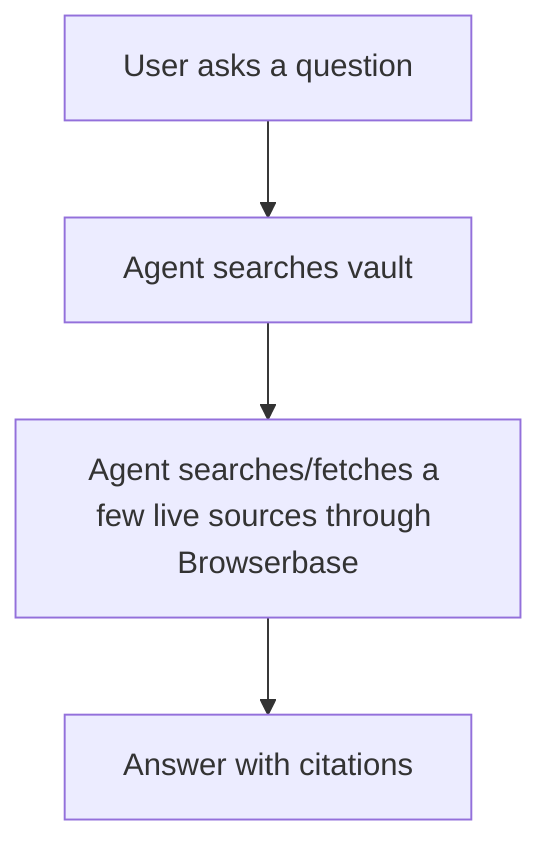
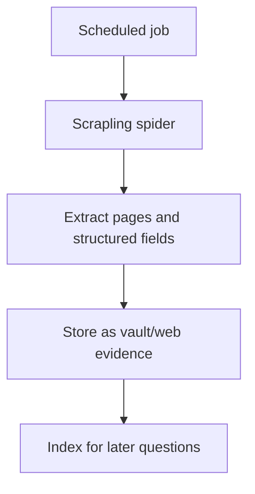

# Web Retrieval Considerations

SubsiWiki starts from stored Obsidian knowledge and only reaches for the live web when the user allows it. This keeps answers fast, cheap, and grounded while still giving the agent a path to current information.

## Browserbase

Browserbase is the simpler first integration for this app because it provides hosted browser infrastructure, web search, lightweight fetch, proxies, observability, and agent-oriented tooling behind one service boundary.

In the current implementation:

- `search_web` calls Browserbase Search at `POST /v1/search`.
- `fetch_url` calls Browserbase Fetch at `POST /v1/fetch` when `BROWSERBASE_API_KEY` is set.
- If Browserbase is not configured, `fetch_url` falls back to direct server-side fetching.

Browserbase Fetch is best for quick page retrieval. It does not execute JavaScript and has response size and timeout limits, so JavaScript-heavy pages may eventually need full browser sessions through Playwright or Stagehand.

## Scrapling

Scrapling is still a strong option, but it solves a slightly different problem. It is a Python scraping and crawling framework with fetchers, dynamic fetchers, stealth fetchers, spiders, adaptive selectors, proxy rotation, sessions, and an MCP server.

Scrapling becomes attractive when SubsiWiki needs:

- Scheduled crawls across many pages.
- Repeatable extraction from structured pages.
- CSS/XPath-heavy scraping.
- Adaptive selectors that survive site changes.
- Self-hosted control over crawling and parsing.
- High-volume ingestion where managed browser costs become significant.

The trade-off is operational complexity. A production Scrapling deployment likely needs Python workers, queues, browser dependencies, proxy configuration, crawl checkpoints, and worker-level observability.

## Recommended Split

Use Browserbase first for user-facing research:

Use Scrapling later for ingestion workflows:

This keeps the interactive agent simple while leaving room for serious scraping infrastructure when it is justified.

## Production Concerns

For many users in parallel, add these before allowing broad live web use:

- Per-user and per-tenant budgets.
- Per-domain concurrency limits.
- URL allow/deny lists.
- Robots.txt policy for crawls.
- Cache by normalized URL and content hash.
- Run logs that record tool calls, URLs, timestamps, and source IDs.
- A queue for long-running browser sessions or crawls.
- Tenant isolation for stored pages and browser contexts.

The model should not receive an open-ended browser unless the product really needs it. Prefer narrow tools that return clean evidence.

## Current Limitations

- Live fetched pages are not persisted.
- Direct fallback fetch does not render JavaScript.
- Browserbase full browser sessions are not wired yet.
- Search requires `BROWSERBASE_API_KEY`.
- Retrieval is lexical, not vector-based.
- There is no user or tenant model yet.

These limitations are acceptable for the current local MVP because the main architecture is now in place: the agent gathers evidence through narrow tools and answers from that evidence.
